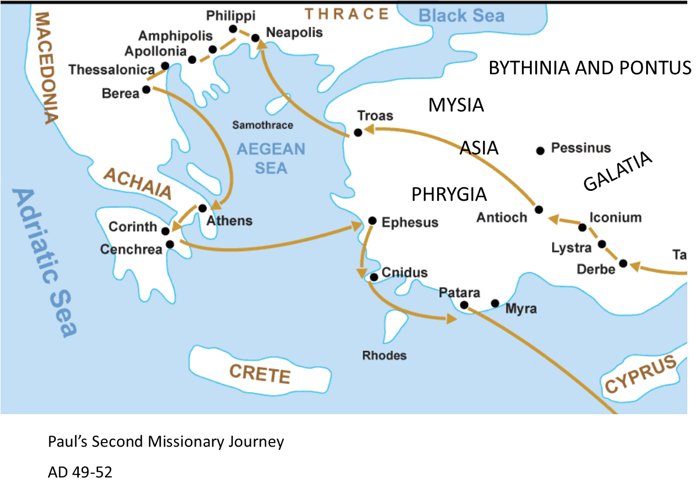

# Philippians Background Info

!!! Caution "Context"
    Context is vitally important for understanding the meaning and intention of a letter. Getting a grasp on the background information for the sender and receiver is very helpful and a crucial part of the context. 

## About Philippi the City
- Philippi was a roman colony that was full of retired soliders
- People were known there for their patriotic nationalism
- It was a leading city in it's district (Acts 16:12)
- Paul faced resistence when introducing the true King (vs. Emporer)
- Philippi may not have had any synagogues
- Those who followed Jesus faced resistence and even persecution but they remained faithful

## Questions
1. Who wrote this letter? The Apostle Paul
2. Who is this letter written to? Christians in Philippi
3. When was it written? Traditionally 61/62 A.D.
4. What is the situation of the recipients? 
    - The Church in Philippi was founded about eleven years before this letter - during Paul's second missionary journey (Acts 16:11-40). He went in response to his Macedonian vision
    - It was the first church on the continent of Europe
    - The Philippian church likely consisted of several house churches
    - Division existed and was likely disagreement between two of Paul's fellow laborers - maybe leaders of separate house churches (4:2-4)
    - Any opposition that may have existed to Paul is likely from Jewish Christians who advocated circumcision (3:2-21)
5. What is the situation of the author?
    - Paul is writing from his Roman house arrest (Acts 28:30-31).
    - He was waiting for his court appearance before Caesar
    - This was around the year A.D. 61
6. Why did the Paul write this letter?
    - To thank the Philippians (4:10-20)
    - The Philippian churches had sent one of their members Epaphroditus to Paul to give him a financial gift to help him while he was in prison. 
    - To address issues
    - To exhort them to work together
    - To call them to unity (1:27, 2:2, 14)

## Paul's 2nd Missionary Journey

Notice Philippi north of the Aegean Sea. Paul visited the city during his 2nd missionary journey. Read Acts 16:6-40

